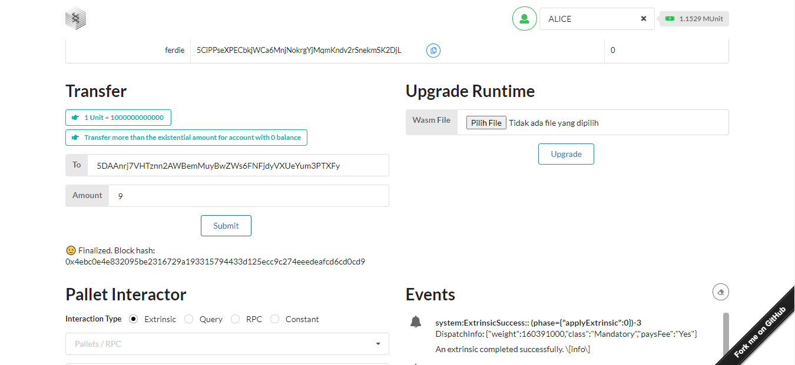

Create Your First Substrate Chain
---------------------------------

### Depedencies

-   [Subtrate](https://github.com/paritytech/substrate)
-   [Rust](https://rustup.rs/)
-   [Node Js](https://nodejs.org)
-   [Yarn](https://yarnpkg.com)
-   [LLVM](https://llvm.org/)
-   [Substrate Node
    Template](https://github.com/substrate-developer-hub/substrate-node-template)
-   [Substrate Frontend
    Template](https://github.com/substrate-developer-hub/)

##### Follow the commands below to prepare the environment. 

``` bash
$ sudo apt update 
$ sudo apt upgrade
$ sudo apt install -y build-essential ocaml ocamlbuild automake autoconf libtool wget python libssl-dev git cmake perl pkg-config curl llvm-10 clang-10 libclang-10-dev
$ curl --proto '=https' --tlsv1.2 -sSf https://sh.rustup.rs | sh
$ source ~/.cargo/env
```

``` bash
$ curl -sL https://deb.nodesource.com/setup_current.x | sudo -E bash -
$ sudo apt-get install -y nodejs
$ sudo npm install -g yarn
```

##### Test the installation

``` bash
$ rustup --version
$ cargo --version
$ llvm-ar-10 --version
$ node --version
$ yarn --version
```

#### Clone Substrate Node Template and Frontend Template and run the initialization script

``` bash
$ sudo git clone https://github.com/substrate-developer-hub/substrate-node-template.git
$ cd substrate-node-template
$ make init
$ make build

$ sudo git clone https://github.com/substrate-developer-hub/substrate-front-end-template.git
$ cd substrate-front-end-template
$ yarn install
```

#### Run Substrate Node Template by running:

``` bash
$ cd substrate-node-template
$ ./target/release/node-template --dev --tmp
```

#### Start Frontend Template

-   navigate to Frontend Template Directory

``` bash
$ cd substrate-front-end-template
$ yarn run start
```

#### Interact with Frontend Template

eg:

-   Transfer




